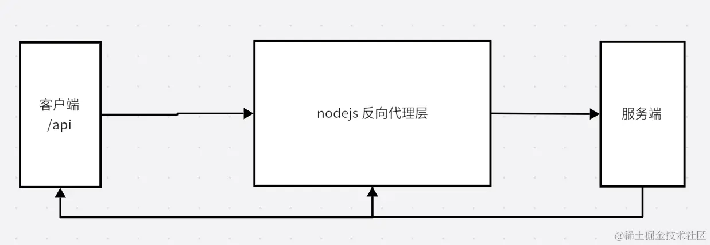

# NodeJs 实现反向代理

## 1. 什么是反向代理

反向代理（Reverse Proxy）方式是指以代理服务器来接受 internet 上的连接请求，然后将请求转发给内部网络上的服务器，并将从服务器上得到的结果返回给 internet 上请求连接的客户端，此时代理服务器对外就表现为一个反向代理服务器。

- 反向代理就是服务器和客户端之间的一个中介，它接收客户端的请求，并转发给服务器，然后将服务器的响应转发给客户端。
- 反向代理可以隐藏服务器的存在和实现负载均衡。也就是可以将客户端的请求转发给不同的服务器，从而实现负载均衡的效果。
- 缓存和性能优化：反向代理可以缓存静态资源或经常访问的动态内容，以减轻后端服务器的负载并提高响应速度。它还可以通过压缩、合并和优化资源等技术来优化网络性能
- 

## 2. 为什么需要反向代理

- 保证内网的安全，使用反向代理可以阻止恶意代码的攻击。
- 负载均衡，通过反向代理服务器来优化网站的负载。
- 提高网站的性能，通过反向代理服务器来优化网站的负载。
- 突破浏览器的限制，通过反向代理服务器来优化网站的负载。
- 实现安全防护，通过反向代理服务器来优化网站的负载。

## 3. 实现反向代理

### 3.1 安装

```
npm install http-proxy-middleware -D
```

### 3.2 配置--根目录自定义 xxx.config.js

```js
module.exports = {
  // ...
  Server: {
    proxy: {
      // 匹配所有以/api开头的请求，将它们转发到目标服务器
      // 例如：/api/user/1 将被转发到 http://localhost:3000/api/user/1
      "/api": {
        target: "http://localhost:3000",
        changeOrigin: true,
      },
    },
  },
};
```

### 3.3 使用

步骤-需要启动两个服务，一个是代理服务，一个是目标服务。

```js
//第一个服务
const http = require("node:http");
const fs = require("node:fs");
const url = require("node:url");
const { createProxyMiddleware } = require("http-proxy-middleware");
const html = fs.readFileSync("./index.html"); //读取html返回给客户端
const config = require("./proxy.config.js"); //导入配置文件
//创建第一个服务
http.createServer((req, res) => {
    //获取请求地址
    const { pathname } = url.parse(req.url);
    //获取要代理的路由数组
    const proxyList = Object.keys(config.server.proxy);
    //匹配到就代理
    if (proxyList.includes(pathname)) {
      const proxy = createProxyMiddleware(config.server.proxy[pathname]);
      console.log("代理请求", config.server.proxy[pathname], pathname); //{ target: 'http://localhost:8888', changeOrigin: true }
      proxy(req, res); //此时假如匹配到的地址就会被代理转发,例如：请求http://localhost:80/api就会被代理到http://localhost:8888
      return;
    }
    res.writeHead(200, { "Content-Type": "text/html" });
    res.end(html);
  })
  .listen(80, () => {
    console.log("第一个服务已启动，监听80端口");
  });
```

- 第二个服务

```js
//启动第二个服务--真实的服务器(要代理到的地址)
const http = require("node:http");
http.createServer((req, res) => {
    res.statusCode = 200;
    res.setHeader("Content-Type", "application/json");
    res.end("第二个服务返回的,你代理成功了");
  })
  .listen(8888, () => {
    console.log("第二个服务启动成功,端口号8888");
  });
```

## 4. 参考资料

- [NodeJs 实现反向代理](https://www.jianshu.com/p/50692910653a)
